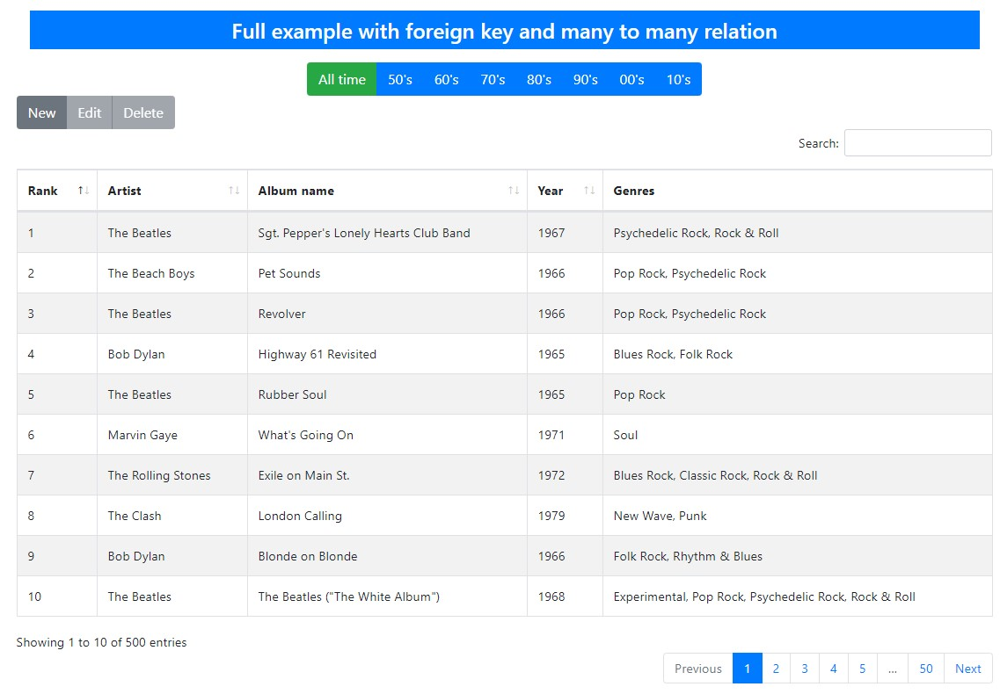

The example app
===============

django-rest-framework-datatables comes with an example application (the Rolling Stone top 500 albums of all time).
It's a great start for understanding how things work, you can play with several options of Datatables, modify the python code (serializers, views) and test a lot of possibilities.

We encourage you to give it a try with a few commandline calls:

.. code:: bash

    $ git clone https://github.com/izimobil/django-rest-framework-datatables.git
    $ cd django-rest-framework-datatables
    $ pip install -r requirements-dev.txt

You need to download `Datatables Editor <https://editor.datatables.net/download/>`_, the JS+CSS version, and unpack the downloaded archive in
``django-rest-framework-datatables/static``

.. code:: bash

    $ python example/manage.py runserver
    $ firefox http://127.0.0.1:8000

A screenshot of the example app:

