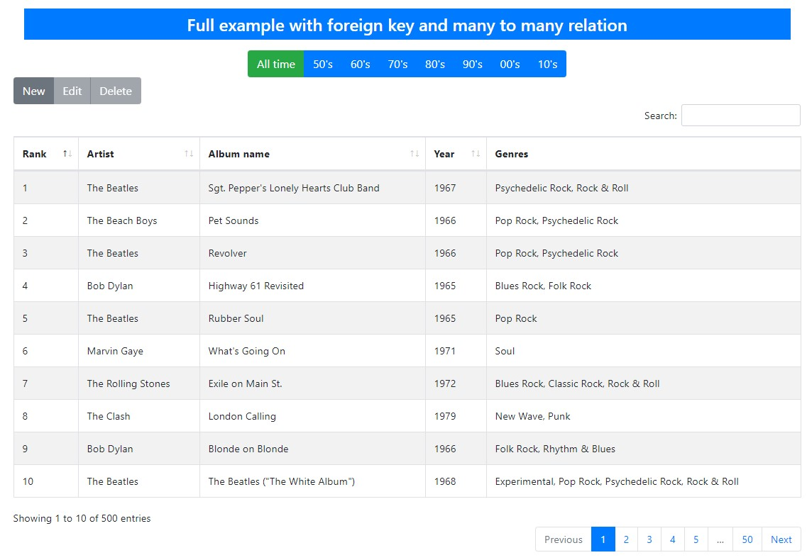

.. django-rest-framework-datatables documentation master file, created by
   sphinx-quickstart on Sat Apr 27 14:24:31 2019.
   You can adapt this file completely to your liking, but it should at least
   contain the root `toctree` directive.

Welcome to django-rest-framework-datatables's documentation!
===================================================================

Seamless integration between Django REST framework and Datatables with supporting Datatables Editor.

**Django Rest Framework + Datatables + Editor = Awesome :)**

.. toctree::
   :maxdepth: 2
   :caption: Contents:

   introduction
   quickstart
   tutorial
   example-app
   changelog

Useful links
------------

- `Github project page <https://github.com/izimobil/django-rest-framework-datatables/>`_
- `Bugtracker <https://github.com/izimobil/django-rest-framework-datatables/issues>`_
- `Documentation <http://django-rest-framework-datatables.readthedocs.io/en/latest/>`_
- `Pypi page <https://pypi.org/project/djangorestframework-datatables/>`_
